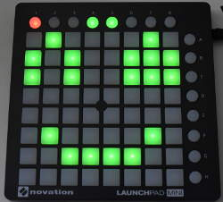

JavaScript library for interacting with the Novation Launchpad Mini.

Other node.js libraries exist, which you may want to consider as well, like:

* [launchpadder](https://www.npmjs.com/package/launchpadder)
* [midi-launchpad](https://www.npmjs.com/package/midi-launchpad)
* [phi-launchpad](https://www.npmjs.com/package/phi-launchpad)

I am writing this yet-another-lauchpad-library because:

* phi-launchpad would be nice because it has support for double-buffering, but it does not even start for me
* midi-launchpad works, but is no longer maintained
* launchpadder works as well and is simple, but does not provide double-buffering



## Usage

    const Launchpad = require( 'launchpad-mini' ),
          pad = new Launchpad();
    pad.connect()                       // Auto-detect Launchpad
        .then( () => pad.reset( 2 ) );  // Make Launchpad glow yellow

## Documentation

Product page: [Novation Launchpad Mini](https://global.novationmusic.com/launch/launchpad-mini)

Novation provides a reference on [their download page](https://global.novationmusic.com/support/product-downloads?product=Launchpad)
(direct link: [Launchpad MK2 Programmer’s Reference Manual](https://global.novationmusic.com/sites/default/files/novation/downloads/10529/launchpad-mk2-programmers-reference-guide_0.pdf))
describing the MIDI interface of the Launchpad MK2 models. 

For the Launchpad Mini, see the Programmer’s Manual in this repository’s `doc/` subdirectory. It is also
written by Novation, but for some reason it is not available on their web site.

## API

All methods are documented in the code, so your IDE should provide you with documentation and type annotation.
The documentation below is mainly an overview and not equally precise.

**Buttons:**

        0 1 2 3 4 5 6 7 8 (x)
     8  o o o o o o o o
     0  [][][][][][][][] o
     1  [][][][][][][][] o
     2  [][][][][][][][] o
     3  [][][][][][][][] o
     4  [][][][][][][][] o
     5  [][][][][][][][] o
     6  [][][][][][][][] o
     7  [][][][][][][][] o
    (y)

**Colors:** 

Launchpad buttons are lit by a red and a green LED each; combined, they give Amber.

    Launchpad.Off
    Launchpad.RedLow
    Launchpad.RedMedium
    Launchpad.RedFull
    Launchpad.GreenLow
    Launchpad.GreenMedium
    Launchpad.GreenFull
    Launchpad.AmberLow
    Launchpad.AmberMedium
    Launchpad.AmberFull
    Launchpad.YellowFull

### Events

The launchpad object sends out events using the [Node.js EventEmitter](https://nodejs.org/dist/latest-v5.x/docs/api/events.html).
Subscribe with e.g.

    pad.on( 'connect', () => console.log( 'Launchpad connected!' ) ); 

#### connect

Emitted when connection to a Launchpad has been established.

#### disconnect

Emitted when the ports have been closed, usually after calling `pad.disconnect()`.

#### key

Emitted when a key is pressed or released. An object of the following format is passed:

    { x: 1, y: 3, pressed: true }

Example usage:

    pad.on( 'key', k => {
        console.log( `Key ${k.x},${k.y} down: ${k.pressed}`);
    } );

### Methods

#### pad.connect( port )

Connects to the launchpad. The MIDI `port` can optionally be specified; if not given, the first Launchpad that is found
is taken. Returns an ES6 Promise.

```js
pad.connect().then( () => {
    // Connected; do something!
}, msg => { console.log('Could not connect: ', msg); } )
```

#### pad.disconnect()

Disconnect.

#### pad.availablePorts

A getter which returns available MIDI ports where a Launchpad is connected (other MIDI devices are not returned).
Probably useful if you have more than one Launchpad connected.

#### pad.reset( brightness )

Resets the pad's mapping mode, buffer settings, and duty cycle. The optional `brightness` parameter sets all LEDs 
to the defined brightness between `1` (low) and `3` (high), other values switch the LEDs off.

    pad.reset(); // Turn off all LEDs

#### pad.col( color, buttons )

Sets the color for the given buttons. The `buttons` parameter is either a value pair `[0,0]` to `[8,8]` specifying 
a single button, or an array of such pairs. Example:

    pad.col( Launchpad.GreenFull, [ [0,0], [1,1], [2,2] ] );

#### pad.pressedButtons

A getter, which returns an array of `[x,y]` pairs of buttons which are currently pressed.

    pad.pressedButtons
    // -> [ [0,0], [2,7] ]

#### pad.multiplexing( num, den )

Set the low/medium button brightness. Low brightness buttons are about `num/den` times as bright 
as full brightness buttons. Medium brightness buttons are twice as bright as low brightness.

`num` must be between 1 and 16, `den` between 3 and 18.

Default is `1/5` when `num` and `den` are not given.

    pad.multiplexing( 2, 4 );

#### pad.fromMap( map )

Generates a coordinate array from a string map, like the template for the picture on top:

    pad.col( Launchpad.GreenFull, pad.fromMap(
            '-x----x-o' +
            'x-x--xxxo' +
            'x-x--xxxo' +
            '--------o' +
            '--------o' +
            '-x----x-o' +
            '--xxxx--o' +
            '---------' +
            'oooxxooo '
        ) );

The string map is **9×9 characters** long without line breaks. The 9th character per row
is the scene button on the right. The last row consists of the 8 buttons on top.

All buttons with a lowercase `x` will be returned, all others
will not. The map can be shorter, e.g. `-xx` would produce `[ [1,0], [2,0] ]`.
