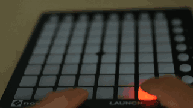

JavaScript library for interacting with the Novation’s midi board LAUNCHPAD MINI.

This library is based on ES6 and works with `Promise`s. It also *auto-detects* your Launchpad and provides
accurate documentation of the library and the Launchpad itself. For latter, check the
[git repository](https://github.com/Granjow/launchpad-mini/tree/master/doc).

This yet-another-lauchpad-library exists because other libraries did not compile, did not start,
are no longer maintained, or lack some useful features. Nevertheless, take a look at
[launchpadder](https://www.npmjs.com/package/launchpadder),
[midi-launchpad](https://www.npmjs.com/package/midi-launchpad),
and [phi-launchpad](https://www.npmjs.com/package/phi-launchpad), which you might like as well.




## Usage

```js
const Launchpad = require( 'launchpad-mini' ),
      pad = new Launchpad();

pad.connect().then( () => {     // Auto-detect Launchpad
    pad.reset( 2 );             // Make Launchpad glow yellow
    pad.on( 'key', k => {
        // Make button red while pressed, green after pressing
        pad.col( k.pressed ? pad.red : pad.green, k );
    } );
} );
```

## Installation

    npm install --save launchpad-mini

Node.js >=4.8.4 is required. Also, `launchpad-mini` depends on [midi](https://www.npmjs.com/package/midi); see the requirements for your OS there.
On Linux, usually install `libasound2-dev` and you are good.

## Documentation

Product page: [Novation Launchpad Mini](https://global.novationmusic.com/launch/launchpad-mini)

Novation provides a reference on [their download page](https://global.novationmusic.com/support/product-downloads?product=Launchpad)
(direct link: [Launchpad MK2 Programmer’s Reference Manual](https://global.novationmusic.com/sites/default/files/novation/downloads/10529/launchpad-mk2-programmers-reference-guide_0.pdf))
describing the MIDI interface of the Launchpad MK2 models.

For the Launchpad Mini, see the Programmer’s Manual in this repository’s `doc/` subdirectory. It is also
written by Novation, but for some reason it is not available on their web site.

## API

*Changes since 2.0.0*

* All buttons now have a property `id : Symbol` which uniquely identifies the button.
* To conveniently draw patterns, run `node_modules/.bin/launchpad-mini-print-buttons`

All methods are also documented in the code, so your IDE should provide you with
documentation and type annotation.

**Table of Contents**

* Overview: [Buttons](#buttons), [Colors](#colors), [Buffers](#buffers)
* [Events](#events) `connect` `disconnect` `key`
* [Launchpad object](#launchpad-object)
* [Methods](#methods) – most used:
  * Connect with [connect( port )](#padconnect-port-)
  * Disconnect with [disconnect()](#paddisconnect)
  * Flush with color with [reset()](#padreset-brightness-)
  * Set button color(s) with [col( color, keys )](#padcol-color-buttons--promise)
  * Define which buffer is displayed with [setBuffers( args )](#padsetbuffers-args-)
  * Check if a key is pressed with [isPressed( key )](#padispressed-button-)
  * Get buttons based on a string array with [fromMap( drawing )](##padfrommap-map-)
* [Examples](#examples)


#### Buttons

The Launchpad has

* 8 round *Automap/Live Buttons* on top,
* 8 round *Scene Buttons* on the right,
* 64 square *Grid Buttons* on the main area.

In code, the Automap buttons have column number 8 (not 0).

        0 1 2 3 4 5 6 7 8 (x)
     8  o o o o o o o o
     0  [][][][][][][][] o
     1  [][][][][][][][] o
     2  [][][][][][][][] o
     3  [][][][][][][][] o
     4  [][][][][][][][] o
     5  [][][][][][][][] o
     6  [][][][][][][][] o
     7  [][][][][][][][] o
    (y)

#### Colors

Launchpad buttons are lit by a red and a green LED each; combined, they give Amber.

Yellow also kind of exists, but the colour difference is marginal and only visible
on full power level, therefore others are not provided.
```js
pad.red     // Or: Launchpad.Colors.red
pad.green   // Or: Launchpad.Colors.green
pad.amber   // etc.
pad.off
pad.yellow
```

Each LED supports 3 power levels: off, low, medium, and (default) full.
```js
pad.red.off
pad.red.low
pad.red.medium
pad.red.full
```

Additionally, the color for the other buffer than the active write buffer (see below)
can be set simultaneously to either off or to the same color.

```js
pad.red         // write buffer: red, other buffer: unmodified
pad.red.copy    // write buffer: red, other buffer: red
pad.red.clear   // write buffer: red, other buffer: off
```

Modifiers can be chained:

```js
pad.green.medium.copy   // medium green on both buffers
```

#### Buffers

The Launchpad has two buffers `0` and `1` which contain two separate LED states. For example,
in one buffer, all LEDs can be red, and in the other buffer, all LEDs can be green.

By default, buffer `0` is used for displaying and for writing. The assignment can be chosen
freely, for example:


    ── Buffer 0  ──       ── Buffer 1  ──
    r r r r r r r r       g g g g g g g g
    r r r r r r ...       g g g g g g ...
    ...                   ...
    ───────────────       ────────────────
              │                │
              └── Display 0    │
                  Write to 1 ──┘

By alternating the displayed buffer, buttons can be made blinking.

---

### Events

The launchpad object sends out events using the [Node.js EventEmitter](https://nodejs.org/dist/latest-v5.x/docs/api/events.html).
Subscribe with e.g.

```js
pad.on( 'connect', () => console.log( 'Launchpad connected!' ) );
```

#### `connect`

Emitted when connection to a Launchpad has been established.

#### `disconnect`

Emitted when the ports have been closed, usually after calling `pad.disconnect()`.

#### `key`

Emitted when a key is pressed or released. The callback receives a `k` object containing
the x,y coordinates of the button and the state (pressed or not).

```js
k = { x: 1, y: 3, pressed: true, id: Symbol() }
```

Example usage:

```js
pad.on( 'key', k => {
    console.log( `Key ${k.x},${k.y} down: ${k.pressed}`);
} );
```

Actually, there are a few more properties defined on the object:

```js
k = { x: 1, y: 3, pressed: true, 0: 1, 1: 3, length: 2 }
```

The keys `0` and `1` allow to use the object like an array, and it can be passed
to e.g. `.col` directly. Example for highlighting the pressed button:

```js
pad.on( 'key', k => {
    if ( k.pressed ) {
        // Red when button is pressed
        pad.col( pad.red, k );
    } else {
        // Off when button is released
        pad.col( pad.off, k );
    }
} );
```

---

### Launchpad object

#### new Launchpad()

Constructor function.

```js
let pad = new Launchpad();
```

#### Launchpad.Buttons

Contains predefined button coordinates as arrays like `[[0,0],[0,1],[0,2],...,[9,8]]`.

```js
Launchpad.Buttons.All       // All buttons
Launchpad.Buttons.Grid      // 8x8 Grid buttons
Launchpad.Buttons.Automap   // Automap buttons (top row)
Launchpad.Buttons.Scene     // Scene buttons (right row)
```

---

### Methods

#### pad.connect( port, outPort )

Connects to the launchpad. The MIDI `port` and `outPort` can optionally be specified; if not given, the first Launchpad that is found
is taken. If only `port` is specified, use it as both input and output port. If both are specified `port` is used as MIDI input port and `outPort` is used as MIDI output port. Returns an ES6 Promise.

**Important:** When exiting, make sure to disconnect the port again, or you may observe effects like the MIDI port
being blocked until the next restart on Windows.

```js
pad.connect().then( () => {
    // Connected; do something!
}, msg => { console.log('Could not connect: ', msg); } )
```

#### pad.disconnect()

Disconnect.

#### pad.availablePorts

A getter which returns available MIDI ports where a Launchpad is connected (other MIDI devices are not returned).
Probably useful if you have more than one Launchpad connected.

---

#### pad.reset( brightness )

Resets the pad's mapping mode, buffer settings, and duty cycle. The optional `brightness` parameter sets all LEDs
to the defined brightness between `1` (low) and `3` (high), other values switch the LEDs off.

```js
pad.reset(); // Turn off all LEDs
```

#### pad.col( color, buttons ): Promise

Sets the color for the given buttons. The `buttons` parameter is either a value pair `[0,0]` to `[8,8]` specifying
a single button, or an array of such pairs. Example:

```js
pad.col( pad.green, [ [0,0], [1,1], [2,2] ] );
```

This function returns an ES6 promise. It is possible to send data much faster than it
can be processed by Launchpad (according to their docs it is because they use a low-speed
USB version which supports at most 400 messages per second). Then, data gets lost and
the button colours are not correct anymore. To avoid this problem, wait until the data
has been sent before sending more data.

For example, the following code will fail, and at the end the butons have random colors
instead of full green:

```js
let btns = Launchpad.Buttons.All;
for ( let i = 0; i < 10; i++ ) {
    pad.col( pad.red.low, btns );
    pad.col( pad.red.full, btns );
    pad.col( pad.amber.low, btns );
    pad.col( pad.amber.full, btns );
    pad.col( pad.green.low, btns );
    pad.col( pad.green.full, btns );
}
```

Instead, use promises like so:

```js
let btns = Launchpad.Buttons.All,
    loop = ( n ) => {
        pad.col( pad.red.low, btns )
            .then( () => pad.col( pad.red.full, btns ) )
            .then( () => pad.col( pad.amber.low, btns ) )
            .then( () => pad.col( pad.amber.full, btns ) )
            .then( () => pad.col( pad.green.low, btns ) )
            .then( () => pad.col( pad.green.full, btns ) )
            .then( () => n > 0 ? loop( n - 1 ) : null )
            .catch( ( err ) => console.error( 'Oh no: ', err ) );
    };

loop( 32 );
```

#### pad.setColors( buttonsWithColor )

Just like `pad.col()`, but allows to set an individual color for each button. Pass an array
of `[ x, y, col ]` objects to this function.


```js
pad.setColors( [
    [ 0, 0, Launchpad.Colors.green ],
    [ 1, 1, Launchpad.Colors.red ],
    [ 2, 2, Launchpad.Colors.amber ]
] ).then( () => console.log( 'Colors updated.' ) );
```

---

#### pad.flash

Setter which enables button flashing. This activates a Launchpad internal routine which
alternates the LED buffer which is displayed in an internal interval.

If a LED is red in buffer `0` and off in buffer `1`, it will flash red as expected. If it
is amber in buffer `1`, it will toggle between red and amber instead. If it is red in both
buffers, there is no visual change.

```js
pad.flash = true;
```

#### pad.displayBuffer

Getter and setter for choosing the buffer used for displaying the button colours.
Can be set to `0` or `1`. Default is `0`.

```js
pad.displayBuffer;
// -> 0
pad.displayBuffer = 1;
```

#### pad.writeBuffer

Getter and setter for the buffer where LED colours are written to.
Can be set to `0` or `1`. Default is `0`.

```js
pad.writeBuffer;
// -> 0
pad.writeBuffer = 1;
```

#### pad.setBuffers( args )

Alternative interface for changing all buffer settings at once. The `args` parameter
looks as follows:

```js
args = {
    write: 0,               // Write buffer (0 or 1)
    display: 0,             // Display buffer (0 or 1)
    copyToDisplay: false,   // Copy write to display
    flash: false            // Enable flashing
}
```

`copyToDisplay` is useful if you want to change the display buffer while keeping the
LED colours. The contents of the given write buffer (i.e. buffer `args.write`) are then
written to the given display buffer (i.e. `args.display`).

---

#### pad.pressedButtons

A getter, which returns an array of `[x,y]` pairs of buttons which are currently pressed.

```js
pad.pressedButtons
// -> [ [0,0], [2,7] ]
```

#### pad.isPressed( button )

Checks if the given `button` is pressed.

```js
pad.isPressed( [ 0, 1 ] );
// -> true (if the top left grid button is pressed)
```

---

#### pad.brightness( brightness )

Set the button brightness. Buttons have 3 brightness levels:

* *full* — constant brightness, can be changed by switching between low and full power mode
  (hold down the four rightmost Automap buttons while plugging in the Launchpad, and press one
  of the red grid buttons to toggle)
* *low* — defined by the brightness level, defaults to 1/5
* *medium* — twice as bright as low brightness

Launchpad uses fractions for setting the brightness (see `pad.multiplexing()` if you need this
low-level access); this function is a simplified version and takes `brightness` as number
between 0 and 1.

Example for a fade effect:

```js
// First, set all LEDs to low brightness
pad.reset( 1 );

// Fade from dark to bright ...
(new Array( 100 )).fill( 0 ).forEach(
    // Set a bunch of timeouts which will change brightness
    ( empty, ix ) => setTimeout(
        () => pad.brightness( ix / 99 ), // ix ranges from 0 to 99
        ix * 20 // set new brightness every 20 ms
    )
);
```

#### pad.multiplexing( num, den )

Set the low/medium button brightness. Low brightness buttons are about `num/den` times as bright
as full brightness buttons. Medium brightness buttons are twice as bright as low brightness.

`num` must be between 1 and 16, `den` between 3 and 18.

Default is `1/5` when `num` and `den` are not given.

```js
pad.multiplexing( 2, 4 );
```

---

#### pad.fromPattern( pattern )

Generates a coordinate array from a string pattern describing a button row or column.
`pattern` can also be an array of patterns.

This function allows to visually specify buttons from any row/column instead of passing
an array of x/y coordinates. The following example would draw a lying heart:

```js
pad.col( pad.red, pad.fromPattern( [
    'r3    x',
    'r4   x x',
    'r5  x   x',
    'r6 x  x  x',
    'r7 X X X X',
    'sc  x   x'
] ) );
```

Format (case insensitive):

      8012345678 (index)
    MM PPP...    (start with button 0)
    MMpPPP...    (start with button 8)

    MM:  rN – Row N,    e.g. r0 for the first button row
         cN – Column N, e.g. c2 for the 3rd button column
         SC – Scene buttons (equivalent to r8)
         AM – Automap buttons (equivalent to c8)

    P:   x or X
            – Select this button
         . or any other character
            – Do not select this button

    PPP... can be between 0 and 9 characters long.

Scene and Automap buttons can be chosen in several ways. Example for the 5th Automap
button on top:

    AM ....x        Automap column, 5th button from left
    c8 ....x        AM has column index 8
    r4 ........X    5th row, 9th button from top (has index 8)
    r4X             5th row, index “-1” (equivalent to previous version)
                    No space after r4 modifier!

Index 8 can be at the very beginning (visually corresponding to the physical Launchpad)
or at the end (programmer’s perspective) of the pattern.

#### pad.fromMap( map )

Generates a coordinate array from a string map, like the template for the picture on top.
Unlike `fromPattern`, buttons have to be specified consecutively, starting with the top left
grid button. This function is mainly meant for visually specifying buttons on the whole pad.

```js
pad.col( pad.green, pad.fromMap(
        '-x----x-o' +
        'x-x--xxxo' +
        'x-x--xxxo' +
        '--------o' +
        '--------o' +
        '-x----x-o' +
        '--xxxx--o' +
        '--------o' +
        'oooxxooo '
    ) );
```

The string map is **9×9 characters** long without line breaks. The 9th character per row
is the scene button on the right. The last row consists of the 8 buttons on top.

(Yes; there are in fact 80 and not 81 buttons.)

All buttons with a lowercase `x` will be returned, all others
will not. The map can be shorter, e.g. `-xx` would produce `[ [1,0], [2,0] ]`.

Copy/paste template (replace the desired buttons by an `x`):

```js
pad.fromMap(
    '--------o' +
    '--------o' +
    '--------o' +
    '--------o' +
    '--------o' +
    '--------o' +
    '--------o' +
    '--------o' +
    'oooooooo '
)
```
### Examples

`print-selected-buttons.js` Prints the xy coordinates of the currently pressed buttons.

`binary.js` Allows you to set an 8 bit integer's binary digits, and show the resulting number on the pad.

`example.js` Pressed buttons become red, released buttons become green.


## Changelog

### v2.3.3 – 2021-05-11

This release adds types for TypeScript.

### v2.3.1 – 2020-04-04

This release only adds a note to the documentation to use `disconnect()` on exit.

### v2.3.0 – 2019-10-26

* Add option to specifiy a separate output port in `connect()`.
